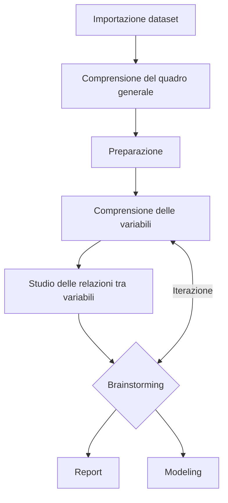

# Analisi Esplorativa dei Dati – Dataset `Diabetes` di `sklearn`

Questo documento segue uno schema strutturato per eseguire un'analisi esplorativa dei dati (EDA) utilizzando il dataset `diabetes` disponibile nella libreria `sklearn.datasets`. Tale approccio è ispirato alla metodologia descritta nel blog *Diario di un Analista* applicato ai vini, che contiene informazioni sulla composizione chimica di vini per un task di classificazione, mentre il mio tentativo qui è di fare un analisi di regressione e non classificazione, quindi stimare una "quantita'" reale di diabete nel paziente da qui ad un anno ad esempio.

## Indice
- [Analisi Esplorativa dei Dati – Dataset `Diabetes` di `sklearn`](#analisi-esplorativa-dei-dati--dataset-diabetes-di-sklearn)
  - [Indice](#indice)
  - [Schema del processo](#schema-del-processo)
- [Fasi dettagliate](#fasi-dettagliate)
  - [1. Importazione del dataset](#1-importazione-del-dataset)
  - [2. Comprensione del quadro generale](#2-comprensione-del-quadro-generale)
    - [🧭 Qual è il problema che vogliamo risolvere?](#-qual-è-il-problema-che-vogliamo-risolvere)
    - [🗒️ Prendere appunti sulle variabili](#️-prendere-appunti-sulle-variabili)
  - [🧰 Funzioni utili di Pandas](#-funzioni-utili-di-pandas)
    - [`.head()` e `.tail()`](#head-e-tail)
    - [`.shape`](#shape)
    - [`.describe()`](#describe)
    - [`.info()`](#info)
  - [3. Preparazione](#3-preparazione)
    - [✅ Applichiamo questi principi al dataset `diabetes`](#-applichiamo-questi-principi-al-dataset-diabetes)
      - [🔹 Variabili ridondanti o da eliminare?](#-variabili-ridondanti-o-da-eliminare)
      - [🔹 Righe duplicate](#-righe-duplicate)
      - [🔹 Nomenclatura delle variabili](#-nomenclatura-delle-variabili)
  - [4. Comprensione delle variabili](#4-comprensione-delle-variabili)
    - [🔍 Variabile target (`diabetes_progression`)](#-variabile-target-diabetes_progression)
    - [🔢 Variabili indipendenti (feature numeriche)](#-variabili-indipendenti-feature-numeriche)
  - [5. Studio delle relazioni tra variabili](#5-studio-delle-relazioni-tra-variabili)
    - [🔗 Analisi esplorativa delle correlazioni](#-analisi-esplorativa-delle-correlazioni)
    - [🎯 Focus sulle relazioni con la variabile target](#-focus-sulle-relazioni-con-la-variabile-target)
    - [🔥 Heatmap di correlazione](#-heatmap-di-correlazione)
  - [6. Brainstorming e ipotesi](#6-brainstorming-e-ipotesi)
    - [💡 Alcune ipotesi e intuizioni](#-alcune-ipotesi-e-intuizioni)
    - [🎯 Cosa possiamo fare a questo punto? (vedi file "analisi\_extra" + la fine dello script py)](#-cosa-possiamo-fare-a-questo-punto-vedi-file-analisi_extra--la-fine-dello-script-py)
    - [❓ Porsi le domande giuste](#-porsi-le-domande-giuste)
  - [7. Output dell’analisi esplorativa](#7-output-dellanalisi-esplorativa)
  - [📘 Per approfondire](#-per-approfondire)
  - [Fonti](#fonti)

## Schema del processo



# Fasi dettagliate

## 1. Importazione del dataset
La pipeline di analisi esplorativa dei dati (EDA) inizia con la definizione di un dataset su cui lavorare. In contesti reali, questo dataset può provenire da fonti diverse: file .csv, database SQL, API, oppure strutture dati in memoria. Tradizionalmente, Pandas consente di caricare i dati tramite funzioni come read_csv(), read_excel() o read_parquet(), a seconda del formato.

Nel nostro caso, per semplicità e coerenza con scopi didattici, non partiremo da un file esterno, ma da un dataset integrato nella libreria scikit-learn, noto come diabetes dataset. Questo approccio è frequente quando si desidera concentrarsi sull’analisi, evitando complicazioni legate all’acquisizione o pulizia iniziale dei dati.

Il dataset diabetes contiene informazioni cliniche su 442 pazienti, raccolte per stimare la progressione del diabete un anno dopo la prima visita. A differenza di altri dataset (come quello sui vini), non si tratta di un problema di classificazione, bensì di regressione: l’obiettivo è predire una variabile numerica continua (target) sulla base di 10 feature normalizzate.

Questo dataset è già in forma di array NumPy e viene facilmente convertito in un dataframe Pandas, che rappresenta una struttura tabellare flessibile e analoga a un foglio Excel. È su questo dataframe che condurremo le fasi successive dell’EDA.


```python
from sklearn.datasets import load_diabetes
import pandas as pd
import numpy as np

# Caricamento del dataset
diabetes = load_diabetes()

# Conversione in DataFrame
df = pd.DataFrame(diabetes.data, columns=diabetes.feature_names)
df['target'] = diabetes.target
```

## 2. Comprensione del quadro generale

In questa prima fase il nostro obiettivo è costruire una **visione d’insieme** del dataset, senza ancora entrare nei dettagli tecnici o statistici.  
L’analisi esplorativa parte sempre da un momento di **osservazione preliminare**, durante il quale si cerca di **comprendere cosa stiamo analizzando**, a che tipo di fenomeno si riferiscono i dati, e quale potrebbe essere l’obiettivo finale.

---

### 🧭 Qual è il problema che vogliamo risolvere?

Nel caso del dataset `diabetes`, il problema è di **previsione clinica**: vogliamo stimare la **progressione del diabete** di un paziente, a partire da una serie di misurazioni cliniche effettuate alla prima visita.

Più precisamente, la variabile `target` ci fornisce un valore numerico che rappresenta la **gravità del diabete** a distanza di un anno.  
Questo significa che ci troviamo in un **contesto di regressione**, dove l’obiettivo è stimare una quantità continua (non classificare per categorie).

---

### 🗒️ Prendere appunti sulle variabili

Un esercizio molto utile in questa fase consiste nel redigere una **scheda descrittiva** delle variabili.  
Possiamo usare Excel o un file di testo per annotare le seguenti dimensioni:

| Variabile | Tipo | Contesto | Aspettativa | Commenti |
|----------|------|----------|-------------|----------|
| `age`    | Numerica (normalizzata) | Età del paziente | Media | Dato normalizzato, non interpretabile direttamente |
| `bmi`    | Numerica | Indice di massa corporea | Alta | Alta correlazione attesa con la gravità del diabete |
| `bp`     | Numerica | Pressione arteriosa media | Media | Potenzialmente informativa |
| `s1`–`s6`| Numerica | Esami ematici (non spiegati) | Variabile | Richiederebbe consultazione documentazione clinica |
| `sex`    | Numerica | Codifica del genere | Bassa | Binaria (-0.0446 uomo, 0.0507 donna), utile per stratificare |
| `target` | Numerica (continua) | Gravità della malattia dopo un anno | - | Variabile dipendente |

L’attributo più importante in questa fase è **“Aspettativa”**:  
ci aiuta a sviluppare l’intuizione rispetto alla **rilevanza potenziale di ciascuna variabile**.  
È un esercizio soggettivo ma fondamentale, perché stimola la riflessione e prepara la selezione delle feature nella fase di modeling.

---

## 🧰 Funzioni utili di Pandas

Durante l’esplorazione iniziale faremo leva su alcune **funzioni fondamentali di Pandas**, che ci aiutano a ottenere una panoramica compatta e sintetica del dataset.

### `.head()` e `.tail()`

Visualizzano rispettivamente le prime e le ultime righe del dataset (default: 5 righe), utili per una prima occhiata.

### `.shape`

Restituisce una **coppia di valori** (righe, colonne) che indica la dimensione del dataset.  
È il primo controllo utile per capire “quanto” stiamo per analizzare.

### `.describe()`

Genera un **resoconto statistico descrittivo** delle colonne numeriche:
- Media, deviazione standard
- Valori minimo, massimo
- Quartili (25%, 50%, 75%)

Questo comando è prezioso per cogliere **la distribuzione e la scala** delle variabili, anche se sono state normalizzate.

### `.info()`

Restituisce un riassunto compatto della struttura del DataFrame:
- Tipo di ogni colonna
- Numero di valori non nulli
- Consumo di memoria

È utile per verificare la presenza di **valori mancanti**, il tipo dei dati e la loro coerenza interna.

---

## 3. Preparazione

Questa fase rappresenta un **passaggio fondamentale** per garantire che i dati siano coerenti, puliti e adatti all’analisi esplorativa e, successivamente, al modeling.  
Qui iniziamo a porci domande concrete sul contenuto e sulla forma del nostro dataset.

Ecco alcuni interrogativi ricorrenti in questa fase:

- Esistono **variabili inutili o ridondanti**?
- Ci sono **colonne duplicate**?
- La **nomenclatura** è chiara e leggibile?
- Ci sono **nuove variabili** che possiamo creare per arricchire l’analisi?

---

### ✅ Applichiamo questi principi al dataset `diabetes`

#### 🔹 Variabili ridondanti o da eliminare?

Tutte le variabili presenti nel dataset sono **numeriche e normalizzate**, e rappresentano **misurazioni cliniche** o biochimiche rilevanti (BMI, pressione arteriosa, esami ematici, ecc.).  
Non ci sono variabili categoriche, costanti o palesemente inutili.  
Non abbiamo quindi motivi fondati per **rimuovere colonne** in questa fase.

#### 🔹 Righe duplicate

Anche se il dataset è generato artificialmente e ben curato, è buona prassi **verificare l’eventuale presenza di duplicati**.  
Questo si può fare con il comando:

```python
df.duplicated().sum()
```

Nel nostro caso, il numero di duplicati è **zero**, ma questa verifica resta fondamentale in contesti reali.

#### 🔹 Nomenclatura delle variabili

Le variabili hanno nomi sintetici (`bmi`, `bp`, `s1`, `s2`, ecc.) coerenti con lo standard di Scikit-learn.  
Tuttavia, alcune di esse (es. `s1`–`s6`) sono poco intuitive e **richiederebbero documentazione esterna** per essere interpretate correttamente.  
Per migliorare la leggibilità, potremmo considerare una **rinomina futura** se si dispone di una descrizione clinica ufficiale.

---

## 4. Comprensione delle variabili

Nel punto precedente abbiamo descritto il dataset nella sua interezza. Ora è il momento di **analizzare singolarmente ciascuna variabile** per comprenderne struttura, distribuzione, e significato. Questo processo viene spesso definito **analisi univariata**.

---

### 🔍 Variabile target (`diabetes_progression`)

Anche se nella nostra analisi il target è **numerico e continuo**, possiamo iniziare analizzandone la **distribuzione**.  
A differenza di un contesto classificatorio, non ci interessa il conteggio per classe, ma piuttosto:

- Come è distribuito il target?
- La distribuzione è normale, asimmetrica, presenta outlier?
- Mostra picchi o code?

📌 Possiamo ottenere informazioni sintetiche con `.describe()` e visualizzarla con un istogramma.

📌 Curtosi e asimmetria ci aiutano a capire se la distribuzione è distorta o ha code anomale (vedi file "NOTE")

---

### 🔢 Variabili indipendenti (feature numeriche)

Tutte le feature del dataset `diabetes` sono **numeriche e normalizzate**.  
Per ciascuna di esse possiamo procedere così:

1. **Ottenere statistiche descrittive** (`.describe()`)
2. **Visualizzare la distribuzione** con istogrammi
3. **Calcolare curtosi e asimmetria** per evidenziare distorsioni

Effettuando questa analisi per ciascuna variabile potremo:

- Comprendere il **comportamento statistico** delle singole feature
- Identificare outlier, picchi, anomalie
- Intuire relazioni potenziali col target

---

## 5. Studio delle relazioni tra variabili

Dopo aver compreso ogni variabile singolarmente, il passo successivo è **indagare come le variabili si relazionano tra loro**, in particolare **come influenzano il target**, cioè la **progressione del diabete**.

Questa fase rappresenta il primo vero momento di **data intelligence**. In contesti clinici, industriali o aziendali, comprendere le relazioni tra variabili significa **trovare leve di intervento**, pattern nascosti, e variabili predittive strategiche.

---

### 🔗 Analisi esplorativa delle correlazioni

Uno dei primi strumenti utili è il **pairplot di Seaborn**, che mostra in un’unica visualizzazione tutte le combinazioni di variabili numeriche tramite diagrammi a dispersione.

```python
import seaborn as sns
sns.pairplot(df)
plt.show()
```

Nel nostro caso, il dataset ha un numero gestibile di feature (10), quindi è computazionalmente accettabile.

Nel pairplot possiamo osservare:
- **Pattern lineari o curvilinei** tra coppie di variabili
- **Allineamenti** tra le feature e la `diabetes_progression`
- **Outlier** evidenti lungo assi specifici

---

### 🎯 Focus sulle relazioni con la variabile target

Per studiare in dettaglio **come ciascuna feature influenza il target**, possiamo creare **diagrammi a dispersione** (`scatterplot`) tra ogni variabile e `diabetes_progression`.

Esempio per `body_mass_index` e `ltg`:

```python
sns.scatterplot(x="body_mass_index", y="diabetes_progression", data=df)
plt.title("BMI vs Progressione diabete")
plt.show()

sns.scatterplot(x="ltg", y="diabetes_progression", data=df)
plt.title("Trigliceridi logaritmici vs Progressione diabete")
plt.show()
```

---

### 🔥 Heatmap di correlazione

Per sintetizzare tutte le relazioni, possiamo generare una **mappa di calore** della matrice di correlazione tra le variabili.

```python
corrmat = df.corr()
sns.heatmap(corrmat, 
            cbar=True, 
            annot=True, 
            square=True, 
            fmt='.2f', 
            annot_kws={'size': 10}, 
            yticklabels=df.columns, 
            xticklabels=df.columns, 
            cmap="Spectral_r")
plt.title("Mappa di correlazione delle variabili")
plt.show()
```

Questo tipo di grafico è estremamente utile per:

- Identificare **le variabili più correlate col target**
- Rilevare **correlazioni interne tra le feature**, ad esempio multicollinearità
- Supportare la selezione di feature per la modellazione

---

## 6. Brainstorming e ipotesi

Giunti a questo punto, abbiamo esplorato in modo sistematico il dataset `diabetes`, individuando pattern, distribuzioni e relazioni significative.  
Possiamo ora dedicarci a un momento riflessivo: **che cosa abbiamo imparato?** E soprattutto: **quali ipotesi possiamo formulare a partire dai dati osservati?**

---

### 💡 Alcune ipotesi e intuizioni

- Il **BMI** e i **livelli logaritmici di trigliceridi (ltg)** sono **fortemente correlati** con la progressione del diabete. Potrebbero rappresentare **fattori di rischio primari**.
- La **pressione sanguigna** sembra anch'essa avere un effetto moderato.
- Le variabili come `hdl_cholesterol` o `sex` sembrano meno rilevanti in questa prima fase esplorativa.
- Potrebbero esserci **interazioni** interessanti da esplorare tra BMI e trigliceridi, oppure tra età e pressione.

---

### 🎯 Cosa possiamo fare a questo punto? (vedi file "analisi_extra" + la fine dello script py)

A seconda del contesto e degli obiettivi, ora possiamo procedere in più direzioni:

1. **Creare un report per gli stakeholder**: comunicare le evidenze raccolte in forma visuale e sintetica.
2. **Avviare la fase di modellazione predittiva**: ad esempio con una regressione lineare o modelli non lineari per predire `diabetes_progression`.
3. **Continuare l’analisi**: approfondire aree poco chiare, verificare outlier, testare altre visualizzazioni.

---

### ❓ Porsi le domande giuste

Questo è il vero salto di qualità per un analista.

Non si tratta solo di saper usare strumenti come Pandas, Seaborn o Matplotlib, ma di **porre le domande corrette**.  
Esempi:

- Esistono sottogruppi di pazienti che mostrano pattern diversi?
- Quali variabili possono essere modificate in un intervento clinico?
- Qual è il profilo tipico del paziente ad alto rischio?

Annotare tutte le domande che sorgono è un esercizio prezioso per affinare il proprio pensiero analitico.

---

## 7. Output dell’analisi esplorativa

Al termine dell’EDA, i prodotti principali sono:

- ✅ Un **DataFrame pulito, documentato e strutturato**
- 📊 Una **serie di visualizzazioni** che raccontano la distribuzione e le relazioni tra le variabili
- 🧠 Un insieme di **intuizioni e ipotesi** che orientano la fase successiva

A seconda del contesto, il prossimo step può essere:

- Modellazione (regressione lineare, Lasso, Random Forest...)
- Condivisione del report tramite notebook o slide
- Ulteriori esplorazioni guidate da nuove domande

---

## 📘 Per approfondire

**Practical Statistics for Data Scientists**
_Peter Bruce & Andrew Bruce_
O'Reilly, 2ª edizione
Ottima panoramica dell’EDA, include esempi su skewness e kurtosis.

**Exploratory Data Analysis**
_John Tukey_
Il testo fondativo sull'EDA (1977)

**Storytelling with Data**  
_Cole Nussbaumer Knaflic_  
Un manuale completo di visualizzazione dati, perfetto per imparare a comunicare con efficacia e chiarezza, soprattutto in ambito aziendale.

## Fonti

- Scikit-learn Documentation: https://scikit-learn.org/stable/datasets/toy_dataset.html#diabetes-dataset  
- Diario di un Analista (2022). *Analisi esplorativa dei dati con Python e Pandas*. Retrieved from: https://www.diariodiunanalista.it/posts/analisi-esplorativa-dei-dati-con-python-e-pandas/  
- Pedregosa et al. (2011). *Scikit-learn: Machine Learning in Python*. JMLR 12, pp. 2825–2830. https://jmlr.org/papers/v12/pedregosa11a.html
- Exploratory Data Analysis – Hoaglin, Mosteller & Tukey (1983) In Journal of the American Statistical Association

---

Grazie!
